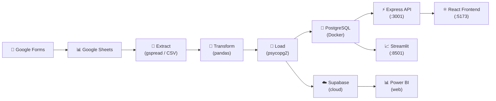

# FabLab Admin Portal — Full Stack ETL Pipeline

A portfolio-quality data engineering project for a nonprofit makerspace.
Combines a **React admin portal** with a **Python ETL pipeline**, **PostgreSQL database**,
**Streamlit analytics dashboard**, and **Power BI reporting**.

---

## Architecture



---

## Tech Stack

| Layer | Technology |
|-------|-----------|
| Frontend | React 18, TypeScript, Vite, Tailwind CSS, React Query |
| API | Node.js, Express, TypeScript, Prisma ORM |
| ETL | Python 3.12, pandas, psycopg2, Faker |
| Analytics | Streamlit, Plotly |
| Database | PostgreSQL 15 (Docker local + Supabase cloud) |
| Reporting | Power BI web |
| Infrastructure | Docker Compose |

---

## Quick Start

### Prerequisites
- [Docker Desktop](https://desktop.docker.com/mac/main/arm64/Docker.dmg) (Apple Silicon)
- Node.js 18+
- Python 3.12+

### 1 — Start the database

```bash
docker compose up -d
# PostgreSQL is now running on localhost:5432
```

### 2 — Set up the backend

```bash
cd backend
npm install
npx prisma migrate dev --name init   # create all tables
npx prisma db seed                    # seed admin user + inventory items
npm run dev                           # API starts on :3001
```

### 3 — Start the frontend

```bash
cd frontend
npm install
npm run dev                           # App opens at http://localhost:5173
# Login: admin@fablab.com / admin123
```

### 4 — Run the ETL pipeline

```bash
# Install Python dependencies (from project root)
pip install -r requirements.txt

# Generate realistic sample data and load it into PostgreSQL
python etl/run_pipeline.py --seed
```

### 5 — Start the Streamlit dashboard

```bash
streamlit run dashboard/app.py
# Opens at http://localhost:8501
```

Or run the full stack via Docker:

```bash
docker compose up
# PostgreSQL: localhost:5432
# Streamlit:  localhost:8501
```

### 6 — Power BI (cloud)

See [docs/powerbi.md](docs/powerbi.md) for step-by-step instructions to connect
Power BI web to a free Supabase cloud database.

```bash
# After creating a Supabase project and setting CLOUD_DATABASE_URL in .env:
python etl/run_pipeline.py --seed --cloud
```

---

## ETL Pipeline

The pipeline runs in three stages:

| Stage | File | Description |
|-------|------|-------------|
| **Extract** | `etl/extract.py` | Reads raw CSVs (mock) or Google Sheets (live) |
| **Transform** | `etl/transform.py` | Cleans names, emails, dates; deduplicates; flags incomplete records |
| **Load** | `etl/load.py` | Upserts clean data into PostgreSQL (idempotent, transactional) |

```bash
python etl/run_pipeline.py              # mock mode (CSVs) → local DB
python etl/run_pipeline.py --seed       # generate seed data, then run
python etl/run_pipeline.py --live       # Google Sheets → local DB
python etl/run_pipeline.py --cloud      # mock → Supabase cloud DB
python etl/run_pipeline.py --seed --cloud  # full demo run → cloud
```

---

## Data Quality

The transform step catches and fixes:

| Issue | Fix |
|-------|-----|
| Mixed-case names (`john smith`, `JOHN SMITH`) | Title-case normalisation |
| Emails with extra whitespace | Strip + lowercase |
| Invalid email formats | Cleared; record flagged as `incomplete` |
| Three date formats (`2024-03-15`, `03/15/2024`, `March 15, 2024`) | Normalised to datetime |
| Duplicate registrations (same student + class) | Keep earliest, remove duplicates |
| Missing email or phone | Status set to `incomplete` for follow-up |

---

## API Endpoints

All endpoints require `Authorization: Bearer <token>` (JWT from `/api/auth/login`).

| Resource | Endpoints |
|----------|-----------|
| Auth | `POST /api/auth/login`, `GET /api/auth/me` |
| Inventory | `GET/POST/PUT/DELETE /api/inventory`, `PATCH /:id/stock` |
| Students | `GET/POST/PUT/DELETE /api/students` |
| Classes | `GET/POST/PUT/DELETE /api/classes` |
| Staff | `GET/POST/PUT/DELETE /api/staff` |
| Equipment | `GET/POST/PUT/DELETE /api/equipment`, `PATCH /:id/status` |
| Attendance | `GET/POST/PUT /api/attendance` |

---

## Project Structure

```
fablabadminportal/
├── frontend/           # React 18 + TypeScript admin portal
├── backend/            # Express + TypeScript + Prisma API
│   ├── prisma/         # PostgreSQL schema + migrations + seed
│   └── src/            # Controllers, routes, middleware
├── etl/                # Python ETL pipeline
│   ├── seed_data.py    # Faker-based sample data generator
│   ├── extract.py      # CSV / Google Sheets extractor
│   ├── transform.py    # pandas cleaning + validation
│   ├── load.py         # psycopg2 PostgreSQL loader
│   └── run_pipeline.py # CLI orchestrator
├── dashboard/          # Streamlit analytics dashboard
│   ├── app.py
│   └── Dockerfile
├── config/             # Centralised Python settings
├── tests/              # pytest test suite
├── docs/               # Architecture + Power BI guides
├── docker-compose.yml  # PostgreSQL + Streamlit services
└── requirements.txt    # Python dependencies
```

---

## Running Tests

```bash
# Unit tests (no database required)
pytest tests/test_transform.py -v

# Integration tests (requires Docker PostgreSQL running)
docker compose up -d
pytest tests/test_load.py -v
```

---

## Future Improvements

- **Scheduled ETL runs** via GitHub Actions or cron
- **Google Forms → Sheets webhook** for real-time ingestion
- **Power BI embedded** in the React admin portal
- **Email notifications** when incomplete registrations are flagged
- **Image upload** for inventory items (Supabase Storage)

---

## Screenshots

> _Add screenshots of the React portal, Streamlit dashboard, and Power BI report here._
