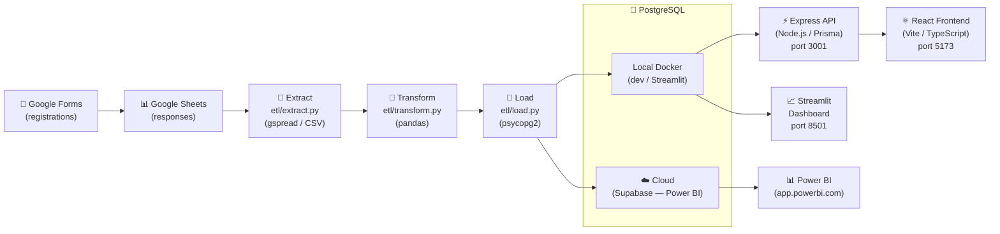

# FabLab System Architecture

## Data Flow



## Component Descriptions

| Component | Technology | Purpose |
|-----------|-----------|---------|
| **Extract** | Python, gspread, pandas | Reads raw data from Google Sheets (live) or CSVs (mock) |
| **Transform** | Python, pandas | Cleans, validates, deduplicates, and enriches raw data |
| **Load** | Python, psycopg2 | Upserts clean data into PostgreSQL (idempotent) |
| **PostgreSQL (local)** | Docker, postgres:15 | Primary database for development and Streamlit |
| **PostgreSQL (cloud)** | Supabase / Neon | Cloud-hosted DB accessible to Power BI web |
| **Express API** | Node.js, TypeScript, Prisma | REST API consumed by the React admin frontend |
| **React Frontend** | React 18, Vite, Tailwind CSS | Admin portal UI for managing classes, students, staff, equipment |
| **Streamlit** | Python, Plotly | Internal analytics dashboard (enrollment + material usage) |
| **Power BI** | Power BI web | Executive-level reporting connected to cloud PostgreSQL |

## Pipeline Execution Modes

```
python etl/run_pipeline.py                 # Mock → Local DB
python etl/run_pipeline.py --seed          # Generate data first, then Mock → Local DB
python etl/run_pipeline.py --live          # Google Sheets → Local DB
python etl/run_pipeline.py --cloud         # Mock → Cloud DB (Supabase)
python etl/run_pipeline.py --seed --cloud  # Generate + load into Cloud DB
```
